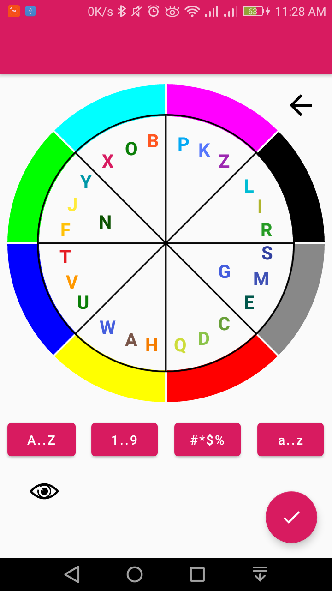
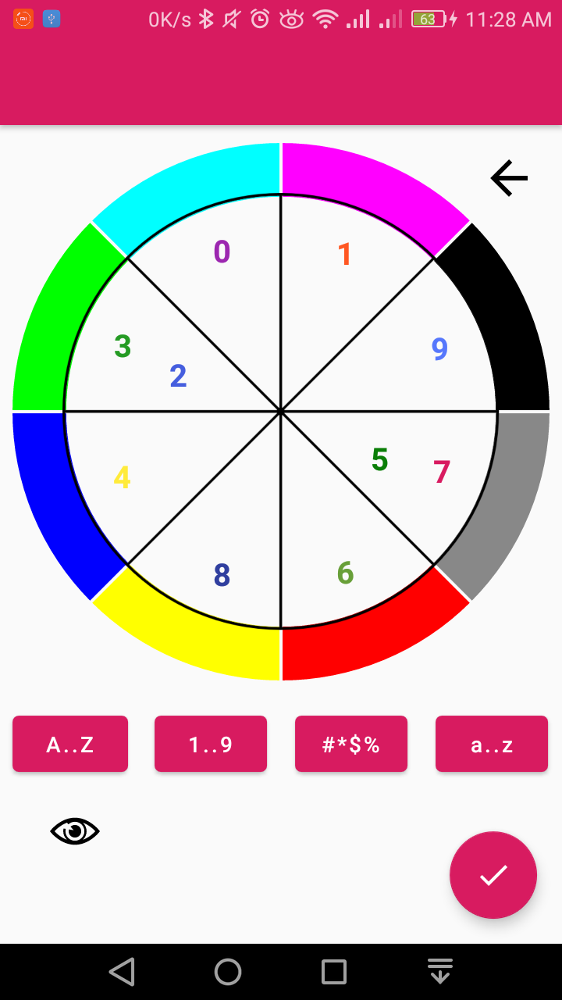
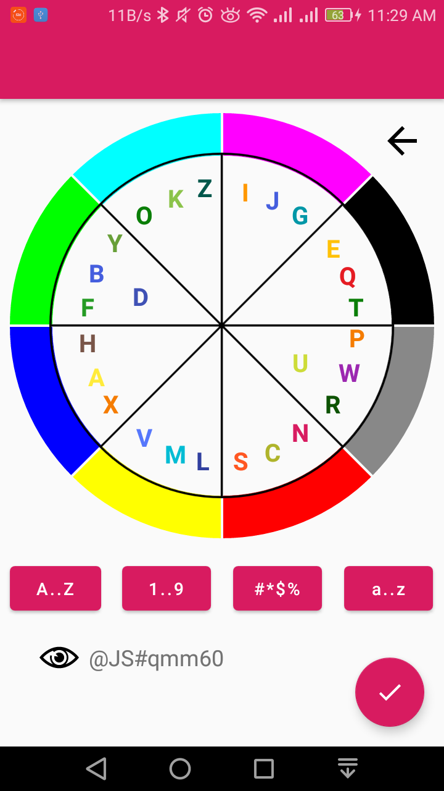

# Password Generator

Generate password by using a wheel.

### Screenshots

||||
| ---- | ---- | ---- |
||||


## Architecture

Password encryption: **sha1Hex** Algorithm

Language: Kotlin

Libraries :-

1. Room
2. Coroutines
3. Digest-util
4. MPAndroidChart


## Try?

Clone this repo.

Android Studio: 3.5

Compile Sdk Version:  28


## License

This project is under [Apache License 2.0]( https://github.com/Iamsdt/Chart/blob/master/LICENSE ).

```
​```
Copyright {2019} {Shudipto Trafder}

Licensed under the Apache License, Version 2.0 (the "License");
you may not use this file except in compliance with the License.
You may obtain a copy of the License at

       http://www.apache.org/licenses/LICENSE-2.0

Unless required by applicable law or agreed to in writing, software
distributed under the License is distributed on an "AS IS" BASIS,
WITHOUT WARRANTIES OR CONDITIONS OF ANY KIND, either express or implied.
See the License for the specific language governing permissions and
limitations under the License.
​```
```